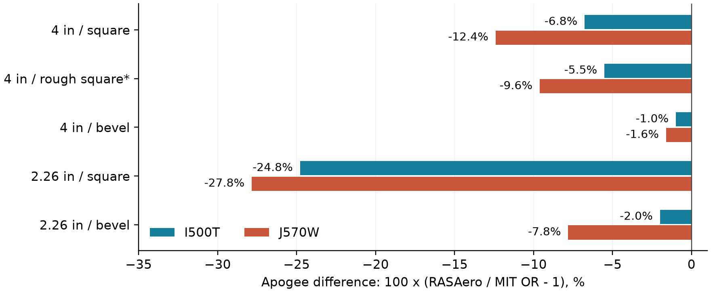
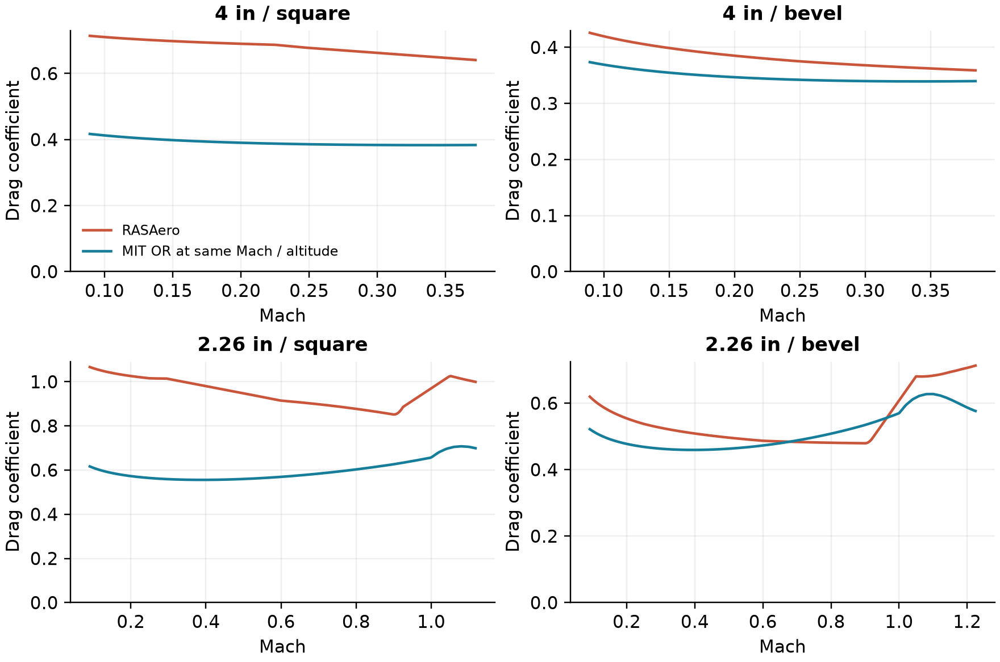

# MIT OpenRocket / RASAero II Controlled flight study

27 September 2026 | Five new designs | Two motors per design | Windows 11 VM

**The main disagreement is aerodynamic drag, with a strong dependence on fin section.** After matching geometry and flow settings, RASAero predicts 1.0-27.8% lower apogee in the eight clean cases. Heavy beveled designs agree within 1.61%; the largest gaps occur on the slender rockets with square-edged fins.

* The rough-finish design B02 has unequal numerical roughness and is excluded from clean simulation attribution. Negative values mean RASAero predicts a lower apogee. All primary RASAero runs have All Turbulent Flow enabled.

### What the study establishes

Replacing only MIT OR's drag coefficient with the curve recorded by RASAero reduces the eight clean apogee differences to **0.04-0.86%**. This supports drag modeling as the dominant cause. It does not determine which program better predicts real flight; no flight measurements were used.

Three export issues need attention: turbulent-flow settings, beveled-fin geometry, and physical roughness mapping. A separate MIT time-step override is confirmed, but actual half-step refinement changes apogee by less than 0.02% here.

RASAero was configured, run and exported through the Windows GUI. MIT OR used the installed MIT application JAR through its simulation/export APIs; all ten baseline cases and ten requested-step repeats were also run inside the VM. Mac/Windows apogees match exactly. This is a flight-prediction study, not a computational-speed benchmark.

## 1. Experimental design

The rockets deliberately remove appendages, active control and multi-stage complications. B01/B03 and B04/B05 isolate fin-edge treatment at fixed planform and mass. B02 exposes the roughness mapping problem. These are simulation fixtures, not qualified flight hardware designs.

| Parameter | B01 / B02 / B03 | B04 / B05 |
| --- | --- | --- |
| Body diameter | 4.000 in (101.60 mm) | 2.260 in (57.404 mm) |
| Overall length | 60.000 in (1.524 m) | 50.000 in (1.270 m) |
| Tangent-ogive nose / body | 12 / 48 in | 10 / 40 in |
| Fins: count; root / tip chord | 4; 6 / 2 in | 3; 5 / 2 in |
| Fin span / leading-edge sweep | 3.25 / 4 in | 2.5 / 2.5 in |
| Thickness; aft-edge inset | 0.125 in; 0.500 in | 0.125 in; 0.500 in |
| Dry structure mass / dry CG | 6.000 kg / 33 in from tip | 1.000 kg / 27 in from tip |

| Design | Surface finish | Fin section |
| --- | --- | --- |
| B01 smooth square | Zero roughness | Square |
| B02 rough square * | OR 60 micrometers; RAS 30.48 micrometers | Square |
| B03 smooth bevel | Zero roughness | 0.25 in nose bevel; square trailing edge |
| B04 slender square | Zero roughness | Square |
| B05 slender bevel | Zero roughness | 0.25 in nose bevel; square trailing edge |

### Shared flight conditions

AeroTech I500T-14A and J570W use the same numerical RASP motor entries, preserved in models/study-motors.eng. Motors are aft-flush with zero overhang and no ignition delay. Dry mass/CG overrides include the structure and recovery system; motor mass and CG are added separately.

Launch altitude 0 m; vertical 2 m rail; zero wind and turbulence; 15 C and 101325 Pa at sea level. MIT OR uses ISA, latitude 45 degrees, longitude 0 and flat-earth geometry. RASAero receives 59 F, 29.9214 inHg and a 6.5617 ft rail. Both use a 24 in parachute, Cd 0.8, at apogee with no delay. Motor ejection is disabled in OR.

No lugs, rail guides, camera pods, tabs, fillets, transitions, fin cant, drag overrides or controllers. RASAero nozzle diameter is zero in these flight runs; later aerodynamic-only probes vary it to examine power-on/off drag sensitivity. Primary runs match the fully turbulent assumption: OR perfectFinish=false; RAS All Turbulent Flow=true.

## 2. Model equivalence and remaining differences

| Item | Observed difference / treatment | Consequence |
| --- | --- | --- |
| Fin-section export | MIT TRIANGULAR exports as Square with a warning. In the GUI, B03/B05 were changed to Hexagonal Blunt Base, FX1=0.25 in, LE radius=0. | Primary bevel runs preserve the pointed leading bevel and blunt trailing edge. Raw exports are retained. |
| Flow assumption | Exporter writes Turbulence=False; MIT OR uses perfectFinish=false. All Turbulent Flow was enabled in RAS for every primary case. | A settings mismatch is removed before solver attribution. Default-flow runs are retained as sensitivity data. |
| Surface roughness | B02: OR NORMAL=60 micrometers; RAS Rough Camouflage Paint=0.0012 in=30.48 micrometers. All other designs use zero. | B02 is a mapping diagnostic, not an equivalent-model comparison. |
| Geometry and units | RAS body length is rounded down by 0.0001 in. Other checked external dimensions match the export. | 2.54 micrometer length rounding is negligible at the displayed precision. |
| Mass and CG | OR retains components and motors; RAS uses entered launch mass/CG and motor data. Launch errors <0.023 g and <0.003 mm. | Initial mass properties match closely. Exported burn mass histories still differ by up to 2.28 g / 6.00 g for I500 / J570. |
| Dynamics | RAS no-wind mode is 2DOF; MIT OR retains its dynamics solver. RAS ascent angle of attack is exactly zero. | This axial benchmark does not compare wind response, damping, CP accuracy or control dynamics. |
| Atmosphere / gravity | ISA versus RAS U.S. Standard Atmosphere implementation; equal sea-level inputs. OR explicitly uses flat geometry. | Implementations and numerical evaluation remain possible sources of sub-percent residuals. |
| Sampling / integration | RAS CSV requested every 0.01 s; OR actual step is about 0.0025 s. RAS Mach, velocity and force columns show sample staggering. | Use direct exported peaks and explicitly matched Mach for aerodynamic comparisons; avoid inferring atmosphere from row-wise force balance. |
| Recovery / internals | Same nominal chute diameter, Cd and apogee trigger. Construction/inertia details are aggregated in RAS. | Ascent metrics are primary. Descent and landing loads are not validated. |

RASAero was run with a per-process English number-format launcher to avoid the VM locale misreading decimal points. The installed application binary and global Windows locale were not modified. The saved native files and CSV outputs were checked for valid decimal values.

## 3. Flight statistics

Primary results: fully turbulent in both programs. Heights are above launch level (also MSL here). Maximum speed and Mach are ascent values. Percent difference is 100 x (RAS / OR - 1). I500 denotes the exact I500T-14A curve.

| Case | Motor | Apogee OR / RAS
(m) | Difference | Max speed OR / RAS
(m/s) | Max Mach OR / RAS |
| --- | --- | --- | --- | --- | --- |
| B01 | I500T | 376.2 / 350.8 | -6.76% | 82.4 / 81.7 | 0.242 / 0.240 |
| B01 | J570W | 889.6 / 779.3 | -12.40% | 131.7 / 128.5 | 0.388 / 0.378 |
| B02 * | I500T | 369.7 / 349.3 | -5.51% | 82.2 / 81.6 | 0.242 / 0.240 |
| B02 * | J570W | 851.8 / 769.9 | -9.61% | 130.6 / 128.1 | 0.385 / 0.377 |
| B03 | I500T | 380.4 / 376.6 | -0.99% | 82.6 / 82.5 | 0.243 / 0.242 |
| B03 | J570W | 910.9 / 896.3 | -1.61% | 132.3 / 131.9 | 0.389 / 0.388 |
| B04 | I500T | 2027.4 / 1525.0 | -24.78% | 364.5 / 349.7 | 1.074 / 1.030 |
| B04 | J570W | 2811.8 / 2029.1 | -27.84% | 479.6 / 437.4 | 1.417 / 1.291 |
| B05 | I500T | 2252.6 / 2207.7 | -1.99% | 369.6 / 368.5 | 1.089 / 1.086 |
| B05 | J570W | 3076.2 / 2836.0 | -7.81% | 486.1 / 463.8 | 1.436 / 1.370 |

| Case | Motor | Time to apogee OR / RAS (s) | Peak ascent acceleration OR / RAS (m/s2) |
| --- | --- | --- | --- |
| B01 | I500T | 9.195 / 8.790 | 78.38 / 77.64 |
| B01 | J570W | 13.612 / 12.490 | 157.27 / 157.14 |
| B02 * | I500T | 9.098 / 8.770 | 78.38 / 77.64 |
| B02 * | J570W | 13.255 / 12.410 | 157.27 / 157.14 |
| B03 | I500T | 9.258 / 9.190 | 78.38 / 77.64 |
| B03 | J570W | 13.817 / 13.650 | 157.27 / 157.14 |
| B04 | I500T | 17.160 / 14.080 | 358.30 / 354.87 |
| B04 | J570W | 19.028 / 15.260 | 603.06 / 601.29 |
| B05 | I500T | 18.373 / 17.960 | 358.41 / 357.32 |
| B05 | J570W | 20.318 / 19.430 | 603.07 / 601.32 |

* B02 is not matched in roughness. Its numbers are included for completeness, not to rank aerodynamic solvers. Peak acceleration is especially sensitive to output sampling and should not be interpreted as independently validated loading. Native RAS summary apogees agree with all ten CSV-derived apogees within 0.005 m.

## 4. Drag-model evidence

MIT OR's installed aerodynamic calculator was evaluated at RASAero's reported Mach, altitude and zero angle of attack along ascent, using OR's ISA atmosphere. The plots show the J570 coast branch above 30 m/s. Matching Mach explicitly avoids the export's Mach/velocity sample offset. Residual atmosphere/Reynolds differences remain.

| J570 case | MIT OR Cd | RAS Cd | RAS / OR |
| --- | --- | --- | --- |
| B01 | 0.384 | 0.639 | 1.67 |
| B03 | 0.340 | 0.359 | 1.06 |
| B04 | 0.588 | 0.920 | 1.56 |
| B05 | 0.550 | 0.785 | 1.43 |

Table: coefficients at the RAS maximum-speed row, with OR evaluated at that row's reported Mach and altitude. Both coefficients use the body frontal reference area. These are comparisons of model predictions, not measured drag.

The square-fin discrepancies persist at common flight states, so they cannot be explained solely by the trajectories reaching different speeds. Beveling changes RASAero's predicted drag and apogee much more than MIT OR's in these fixtures. RAS component drag decomposition was not available in the flight export. The later aerodynamic investigation uses paired finless/finned fixtures to separate the net fin contribution; its internal pressure, friction and interference terms remain unreported by RAS.

## 5. Attribution and numerical checks

### Replace drag; retain MIT OR's flight solver

A diagnostic listener substitutes RASAero's trajectory-derived Cd(Mach) into OR's total and axial drag coefficients. Powered and coast curves are interpolated separately. OR retains its motor, mass, atmosphere, gravity, integrator and other aerodynamic terms. This is an attribution experiment using RAS output, not an independent validation or a recommended production calibration.

| Case | Motor | Original gap vs RAS | OR + RAS drag
apogee (m) | Replay residual
vs RAS |
| --- | --- | --- | --- | --- |
| B01 | I500T | +7.25% | 350.94 | +0.050% |
| B01 | J570W | +14.16% | 780.72 | +0.181% |
| B03 | I500T | +1.00% | 376.75 | +0.042% |
| B03 | J570W | +1.63% | 897.78 | +0.165% |
| B04 | I500T | +32.94% | 1533.69 | +0.570% |
| B04 | J570W | +38.58% | 2045.57 | +0.814% |
| B05 | I500T | +2.03% | 2222.26 | +0.661% |
| B05 | J570W | +8.47% | 2860.33 | +0.857% |

This table uses RAS as the denominator in both difference columns; the flight-statistics table uses OR. All replay apogees are within 0.86% of RAS. The curve is not a complete Cd(Mach, Reynolds number, angle-of-attack) surface; interpolation, altitude dependence and sample timing limit interpretation of the small residual.

### Checks against alternative explanations

| Check | Result |
| --- | --- |
| Shared motor curve | At common exported times: maximum thrust difference 0.00213 N (I500) and 0.00060 N (J570). Thrust RMSE below 0.00041 N. |
| Requested time step | Requests of 0.010 and 0.005 s do not change the actual ~0.0025 s step or the flight statistics. Source and installed bytecode confirm a global-step override. |
| Actual half-step convergence | Set the existing public timing globals from 0.0025 to 0.00125 s in the test process. Largest absolute apogee change across ten cases: 0.0163%. No application source was changed. |
| Windows / Mac repeat | Same MIT JAR and fixture builder: all ten baseline apogees and time histories of altitude, mass, thrust and time match exactly. Remaining compared columns differ only at floating-point roundoff (<8e-15). |
| Output verification | All ten RAS native summary apogees agree with exported CSV peaks. Corrected CDX1 files retain the intended geometry, flow flag and launch settings. |

## 6. Flow-setting sensitivity

The primary comparison matches fully turbulent flow. The initial RAS exports instead allow laminar flow and transition. Turning on All Turbulent Flow lowers RAS apogee by 1.7-19.5% in the clean cases; leaving that setting unmatched can make agreement look much better by cancellation.

| Case | Motor | RAS default flow
apogee (m) | RAS all turbulent
apogee (m) | Change |
| --- | --- | --- | --- | --- |
| B01 | I500T | 372.6 | 350.8 | -5.87% |
| B01 | J570W | 870.2 | 779.3 | -10.45% |
| B02 * | I500T | 372.0 | 349.3 | -6.11% |
| B02 * | J570W | 864.6 | 769.9 | -10.96% |
| B03 | I500T | 383.1 | 376.6 | -1.71% |
| B03 | J570W | 921.6 | 896.3 | -2.74% |
| B04 | I500T | 1895.1 | 1525.0 | -19.53% |
| B04 | J570W | 2410.3 | 2029.1 | -15.82% |
| B05 | I500T | 2341.1 | 2207.7 | -5.70% |
| B05 | J570W | 2986.3 | 2836.0 | -5.03% |

In these default-flow sensitivity runs the beveled-fin geometry had already been corrected. "Default" refers only to the flow flag, not to an entirely uncorrected export. The manual describes RAS default transition at Reynolds number 500,000 and the checked option as immediate turbulent flow [1, pp. 55-56].

### Why the roughness result is not a solver comparison

OR's NORMAL finish represents 60 micrometers. The exported RAS category, Rough Camouflage Paint, represents 30.48 micrometers [1, p. 53]. Equal category intent therefore does not give equal physical roughness. B02 remains explicitly confounded. An improvement to rough-surface aerodynamics cannot be inferred from its flight difference until physical roughness is matched.

### Interpretation of the matched setting

Fully turbulent flow is chosen to match the current OR configuration, not because this study proves that every real rocket is fully turbulent from the tip. A separate measured validation should determine appropriate transition and roughness assumptions. Matching the checkbox removes one disagreement in assumptions; it does not force the two programs to use identical friction correlations.

## 7. Recommended MIT OR improvements

| Priority / status | Change | Acceptance evidence |
| --- | --- | --- |
| 1 / Confirmed export issue | Map perfectFinish=false to RAS Turbulence=True. For transition-enabled OR configurations, explain that transition correlations can still differ. Location: RocketDesignDTO. | Export/reload regression fixtures verify the effective flow assumption and preserve it on save. |
| 1 / Confirmed export issue | Map MIT TRIANGULAR leading bevel to Hexagonal Blunt Base; populate FX1 from the bevel length and preserve thickness/radius. Current mapping warns and substitutes Square. Locations: RASAeroCommonConstants, FinDTO. | Round-trip square and 0.25 in beveled fixtures; compare dimensions and native GUI geometry. |
| 1 / Confirmed mapping limitation | Show source and destination roughness in physical units. Warn whenever no exact RAS category exists; offer explicit mapping choices. Location: surface-finish conversion / ExternalComponent. | A 60 micrometer OR finish must not be presented as numerically equivalent to 30.48 micrometers. |
| 1 / Confirmed timing issue | Restore user/adaptive/event limits for normal flights; isolate controller timing. RK4SimulationStepper currently replaces the selected step with a global theTimeStep when no controller is active. | Tests verify requested limits, event boundaries and refinement. This fix improves timing correctness; it is not expected to close this study's drag gap. |
| 2 / Investigated; no code changes | Prioritize tangent-ogive wave drag, fin-profile/shock treatment, component Reynolds numbers, and base drag. The fixed-Mach aerodynamic investigation below provides controlled evidence and an offline nose-term trial. | Validate proposed changes against the retained 25-case coefficient suite and independent measurements before adoption. |
| 2 / Validation capability | Add an aerodynamic breakdown export and a reproducible benchmark suite using these fixtures: friction, pressure, base, total Cd; Mach, Reynolds, atmosphere, step size and warnings. | Track matched-case residuals and export audits in CI. Use RAS agreement as a regression signal, not as physical truth. |
| 3 / Physical calibration research | Validate transonic/body and bevel correlations with independent flight coast-down or wind-tunnel data; examine component-local Reynolds/transition alternatives. | Hold out independent geometries/fin sections and quantify uncertainty before changing default correlations. |

The code locations refer to the current MIT working tree associated with the tested application. Its source contains custom changes beyond the recorded Git HEAD; SHA-256 hashes of inspected files and installed JAR are preserved. No MIT application code was modified as part of this study.

## 8. Limits, evidence and reproduction

### What remains unresolved

There are eight matched design/motor pairs, not eight independent physical experiments. The matrix covers only zero-wind, single-stage, axial flights and two motor curves. It does not establish CP/stability accuracy, controller behavior, staging, recovery loads or high-Mach performance. B04/B05 with J570 trigger OR's warning that body calculations may be inaccurate at supersonic speeds.

The total drag difference is well supported. The subsequent fixed-Mach investigation identifies nose-wave and fin-profile mechanisms, while the exact RASAero split among fin pressure, friction and interference remains unresolved. Mass depletion, atmosphere/gravity, sample timing and Cd interpolation can contribute to the remaining sub-percent residual. This study does not establish that RASAero is more accurate, and it does not justify a universal multiplier on OR drag.

### Execution and provenance

RASAero II runs in the Windows 11 VM (executable file/product version 1.0.2.0). Its GUI was used to edit profiles/flow settings, rerun each pair, save native CDX1 models and export flight CSVs. A per-process culture wrapper loads the installed executable unchanged. MIT OR designs and exports use the installed application's Java APIs. The same MIT JAR was copied to the VM and executed with bundled OpenJDK 17.0.16+12-LTS for repeat verification.

MIT JAR SHA-256:
d39a932bd26ba8ac9235c01332a93492f90e01f2a465e488d7fa541f31e3f4e6
Source HEAD: e8867552ba16bf53dc67ea4da55fc3c45697048b (plus local custom changes).

| Study folder | Contents / usage |
| --- | --- |
| models/ | Five ORKs with simulated data; raw exports; GUI-corrected exports. Use *-turbulent.CDX1 for the primary comparison. study-motors.eng preserves the two motor curves. |
| openrocket/ and rasaero/ | Raw numerical histories. OR -dt005 files test the requested step; -actual-h00125 files test a true half-step; -ras-cd-replay files are the attribution diagnostic. RAS -turbulent files are primary. |
| evidence/ | Screenshots, export warnings, model audit, common-Mach aerodynamic evaluations, runtime/source hashes, convergence logs and native-summary checks. |
| windows-validation/ | MIT OR baseline/repeat histories and execution log from the Windows VM. |
| scripts/ and figures/ | Fixture generator, analysis and diagnostic source, GUI automation helpers, report/plot builders and standalone scientific figures. |
| comparison-results.json | Machine-readable flight statistics and diagnostics; report.md is the editable report companion. |

For reproduction: run ControlledStudy against the installed MIT JAR, then open each export in RAS and apply the documented profile/flow corrections. Confirm the same engine entries and launch settings; rerun and export CSV at 0.01 s. Run the actual-step diagnostic, StateComparison, DragReplay and analyze_study.py. The archived UI helpers retain session-specific window coordinates/PID and need adjustment for a new desktop session.

### References

[1] RASAero II User Manual: profiles p. 15, roughness p. 53, flow pp. 55-56, flight dynamics/atmosphere pp. 79-80. <link href="https://www.rasaero.com/dloads/RASAero%20II%20Users%20Manual.pdf" color="#167d9a">Official manual (PDF)</link>. Documentation was inspected from the locally retrieved manual.

[2] Installed MIT OpenRocket JAR and associated source tree; evidence/runtime.json and evidence/source-provenance.json identify the exact local artifacts. [3] Native models, raw outputs and GUI evidence in this study directory. All reported flight results are computed from those retained outputs.

