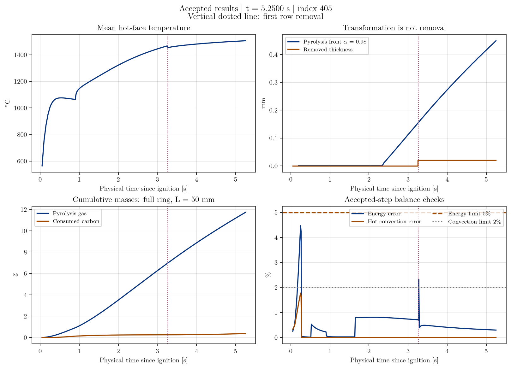
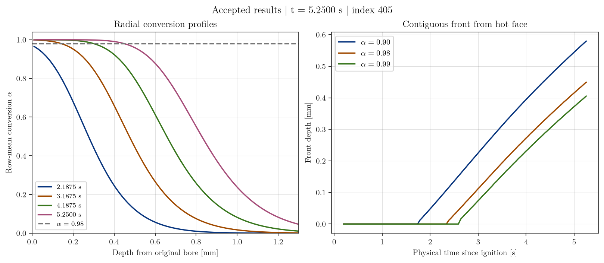
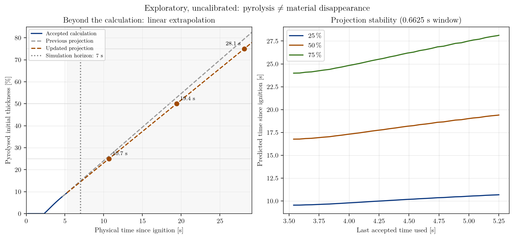

# New motor phenolic study — v0

This directory contains the reproducible inputs and bilingual interim-results
reports for the new two-layer motor model. The nominal diameters are:

- aluminium OD: 6.000 in (152.400 mm);
- aluminium ID / phenolic OD: 5.625 in (142.875 mm);
- phenolic ID: 5.250 in (133.350 mm).

The resulting radial thicknesses are 4.7625 mm for both phenolic and
aluminium.  The analysis uses a 0.10° sector, a 50 mm axial coupon, and a
full-ring scale factor of 3600.

The chamber-pressure input is 800 ± 200 psi: 5.52 MPa nominal, with a
600–1000 psi (4.14–6.89 MPa) sensitivity envelope. Pressure is explicit in
the configuration; gas composition and carbon-oxidation kinetics remain
exploratory until calibrated data are supplied.

## Directory policy

- `model/`: version-controlled generators, controller, UserMatTh source and
  prebuilt ANSYS 2026 R1 DLL;
- `geometry/`: a native MAPDL database containing the two glued volumes plus
  a machine-readable validation record;
- `docs/fr` and `docs/en`: the French report and its English translation;
- `ansystmp/`: ignored Windows runtime, native preflight logs, restart files,
  RTH files, checkpoints, and eventual results.  Nothing in this directory is
  intended for Git.

## Rebuild and native preflight

From macOS, run `model/prepare_model.py`; it creates the ignored runtime under
`ansystmp/windows` without solving.  Windows maps this `v0` directory as drive
`V:`.  The prepared runtime is therefore `V:\ansystmp\windows`.

In Windows PowerShell:

```powershell
V:\ansystmp\windows\launch_v0.ps1 -Preflight
```

The preflight reads the complete native deck but contains no `SOLVE`.  The
accepted package has 229,665 nodes and 152,000 linear SOLID278 hexahedra and
completed with zero MAPDL warnings and zero MAPDL errors.

The simulation is not started by the preparation workflow.  Its first launch
requires an explicit `-Run`.  A clean pause is requested with
`request_pause.ps1`; resume requires both `-Run -Resume` and an accepted
checkpoint.  The local licence is fixed to `1055@localhost`, and a second
ANSYS/MPI process is refused while one already exists.

## Primary result

The principal history quantity is the remaining phenolic thickness,

`phenolic_remaining_thickness_m`,

accompanied by removed thickness, removed initial-equivalent mass, pyrolysis
gas mass, oxidized-char mass, mass residual, and the energy audit.  This keeps
"removed phenolic", "pyrolysis gas", and "burned char" separate instead of
combining physically different quantities.

## Accepted-results snapshot — September 24, 2026

The reports and figures are frozen at **accepted index 405, 5.2500 s**;
the simulation is still running toward 7 s. Only documentation outputs were
updated; the active runtime and solver configuration were not modified.

- [French report](docs/fr/newmotor_phenolic_v0_report.pdf)
- [English report](docs/en/newmotor_phenolic_v0_report.pdf)
- [Reduced accepted dataset and source SHA-256 hashes](docs/analysis/accepted_results_snapshot.json)

The contiguous, volume-weighted row-mean **alpha ≥ 0.98** front reaches
**0.44928 mm (9.43%)** of the initial 4.7625 mm thickness. This is pyrolysis,
not disappearance: only **0.01984375 mm** has been geometrically removed,
leaving **4.74265625 mm** present (not necessarily virgin).





Recent-window linear extrapolations place 25/50/75% pyrolysed thickness at
**10.68 / 19.40 / 28.13 s since ignition**, versus 10.30 / 18.48 / 26.66 s
at the previous 4.6625 s assessment. These are exploratory, uncalibrated
extrapolations beyond the current 7 s horizon, not demonstrated motor lifetimes.
The upward drift reflects a slowing front; the estimates are not converged
predictions. At 7 s, the same fit projects approximately 14.46% pyrolysed.



### Reproduce the documentation figures

From `v0/docs/analysis`, using Python with Matplotlib and a working LaTeX
installation (including `lmodern` and `siunitx`). All planning and results
figures share `latex_style.py`: **`text.usetex=True` and Computer Modern/Latin
Modern serif typography**, including titles, labels, legends, and tick labels.
The white backgrounds, boxed axes, light grey grids, report palette, and French
decimal commas match the earlier `phenolic_case_study/tmp3` documentation.
There is no sans-serif fallback.

```sh
# Offline rebuild using the versioned, frozen dataset (no runtime access).
python3 make_results_figures.py

# Explicit refresh from accepted audits/checkpoints, reading the runtime only.
python3 make_results_figures.py --capture ../../ansystmp/windows
```

The refresh freezes `state.json` at one accepted index, ignores newer audits
and checkpoints, checks audit thresholds, and saves reduced data plus source
hashes. Large result/restart files are neither read nor committed. Fronts use
every fourth checkpoint plus the latest state and the previous comparison
checkpoint. Fits use a fixed trailing 0.6625 s window, with linear interpolation
between radial-row centres at alpha = 0.98. Report prose and tables are tied to
this snapshot and must also be refreshed when publishing newer data.

Recompile each report from its language directory with two passes of
`pdflatex -interaction=nonstopmode -halt-on-error newmotor_phenolic_v0_report.tex`.
