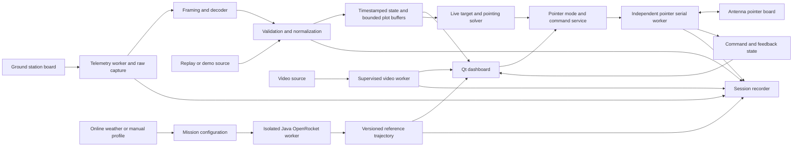

# Rocket UI v0 — end-to-end development plan

> Historical planning baseline. Current serial/control behavior follows the original UI as documented in [Legacy feature parity](docs/LEGACY_PARITY.md) and the [Operator guide](docs/OPERATOR_GUIDE.md).
**Date:** 18 September 2026  
**Status:** Reviewed implementation baseline, ready to begin M0; see [validation and execution readiness](VALIDATION_AND_EXECUTION.md). Application implementation and hardware/package qualification have not started.  
**Location:** `ui_work/rocket_UI_v0/`  
**Working product name:** Rocket GNC Monitor

## 1. Outcome and scope

Build a desktop monitoring application for the team's amateur rocket, including ground antenna pointing. One operator should be able to prepare a mission, connect the ground station board, antenna pointer board, and video receiver, point or track the antenna, watch the flight and control-system state, compare actual motion with a selected simulation, and replay the complete session afterward.

The required production experience is:

1. Obtain the package for the computer's operating system and processor.
2. Extract the Windows folder or copy the macOS `.app` from its disk image.
3. Launch the executable; choose a mission, assign the ground station and pointer to separate serial devices, and select a video source.
4. Operate with bundled software and local mission data. Internet access is needed only for explicitly requested online data such as weather.

The first release includes independent telemetry and pointer serial connections, antenna control and visualization, telemetry decoding, video display/recording, GNC monitoring, actual-versus-reference trajectory display, local session recording/replay, manual/imported wind, online weather retrieval, and an integrated OpenRocket worker for supported rocket models. Windows and macOS are release requirements. Linux is an architectural consideration and later packaging target.

Flight control remains onboard. The desktop application monitors the rocket and actively controls the ground antenna through the dedicated pointer board. Pointer commands use a separate service and port from rocket telemetry. Receiving and displaying reported rocket arming, actuator, and fault state is included; rocket command transmission is outside this monitoring scope.

Repository documentation and source comments were treated as evidence about the existing systems, not as instructions to install software, run launchers, or modify those systems. The references remain untouched.

## 2. Platform decision

**Choose Python with PySide6/Qt 6, Qt Widgets, and PyQtGraph. Keep OpenRocket behind a Java subprocess boundary.**

| Consideration | Python + PySide6 | Java + JavaFX |
|---|---|---|
| Existing telemetry knowledge | Preserve and test the Python decoding rules; straightforward NumPy processing | Reimplement the decoder and verify every conversion |
| Desktop interface | Qt docking, native dialogs, keyboard navigation, custom painting, and live scientific plots | Good desktop option, but new UI and plotting integration for this project |
| OpenRocket integration | Small versioned Java worker launched by the app | Direct Java integration is possible; isolation is still useful for simulation failures |
| Video | Bundle a controlled FFmpeg build behind a video adapter | Still needs video-format validation and potentially a native decoder integration |
| Deployment | Bundle Python and native dependencies with PyInstaller | Bundle a Java runtime with `jpackage` |
| Team development effort | Best fit for the existing decoder and analysis workflow | Attractive if the application were primarily an OpenRocket editor |

Both languages can satisfy the self-contained deployment requirement. The deciding factor is implementation effort across telemetry, visualization, video, and existing analysis code. Java is retained where there is already a substantial Java simulation investment.

PyInstaller explicitly bundles the interpreter and dependencies, but releases must be built for their target platforms. Use its folder-based package as the initial packaging baseline. [PyInstaller deployment model](https://pyinstaller.org/en/stable/operating-mode.html)

Java can also ship a private runtime; `jpackage` documents this distribution model. The Python application will launch its own bundled Java runtime directly, rather than depend on a system installation. [Java packaging overview](https://docs.oracle.com/en/java/javase/17/jpackage/packaging-overview.html)

### Concrete stack

| Component | Initial choice | Reason and boundary |
|---|---|---|
| Application language | CPython 3.12 as the initial compatibility baseline | Pin an exact supported patch and dependency set during the packaging milestone; upgrade before implementation if the selected packages require it |
| Interface | PySide6 / Qt 6 Widgets | Dockable mission dashboard; shared design tokens; custom instruments without a browser runtime |
| Live plots | PyQtGraph + NumPy | Rolling time series and efficient array processing |
| Trajectory and attitude | PyQtGraph 2D views; isolated OpenGL 3D view using PyOpenGL | Linked plan/side views remain available when 3D acceleration is unavailable |
| Serial | pyserial with independent ground station and pointer workers | Separate port ownership, configuration, bounded reads/writes, health, and reconnect state |
| Antenna pointer | Typed pointer service and articulated model in the shared 3D renderer | Azimuth/elevation commands, tracking, command/feedback distinction, 2D fallback |
| Data contracts | Typed Python models plus versioned JSON Schema at file/process boundaries | Explicit units, field validity, provenance, and migrations |
| Video | Bundled FFmpeg/ffprobe with a supervised adapter | Consistent decoder version; restart video independently of telemetry |
| Recording | Framed raw-byte files + SQLite index/decoded data + segmented video | Re-decode later and recover interrupted sessions |
| Weather | Provider interface; Open-Meteo as first online adapter | Manual and cached profiles use the same internal format |
| Simulation | Thin Java 17 runner around a pinned team OpenRocket build | JSON request files and normalized trajectory results |
| Packaging | PyInstaller folder/app bundles; platform-specific release builds | Runtime dependencies included and discoverable by application-relative paths |
| Verification | pytest, pytest-qt, protocol fixtures, Java integration fixtures | Check observable behavior and recorded numerical outputs |

PyQtGraph supports PySide6 and provides 2D/3D scientific graphics; its 3D facilities require OpenGL bindings. The exact renderer must pass tests on the production machines. [PyQtGraph project documentation](https://www.pyqtgraph.org/)

Use Widgets for v0 to keep docking and plot integration straightforward. A fresh visual design does not require QML. If a later design needs QML, preserve the same data/service boundaries. Qt's `pyside6-deploy`/Nuitka is a fallback if the initial PyInstaller experiment finds a concrete packaging problem; do not maintain two release systems unnecessarily. [Qt deployment tool](https://doc.qt.io/qtforpython-6/deployment/deployment-pyside6-deploy.html)

## 3. Findings that shape the design

The [reference audit](REFERENCE_AUDIT.md) records the inspected files and exact limitations.

- The legacy monitor is a useful decoding reference, but its UI timer calls serial-reading code synchronously. The new UI must not perform device reads, simulation, or disk writes on its main thread.
- The current receiver firmware and Python source agree on 115200 baud, two `0xAB` sync bytes, a 128-byte rocket payload, and 14 bytes of receiver metadata. Raw captures and the identity of the installed firmware still need confirmation.
- The pointer is a second serial device. The located firmware corroborates the legacy 11-byte command format, degree-valued setpoints, internal azimuth sign inversion, 5° jog increments, and a software-reference reset for ZERO. Its printed elevation target is neither acknowledgment nor measured feedback. The Python adapter also replaces ground altitude with zero; correct that in the new coordinate contract.
- The pointer firmware chooses the shortest azimuth path and continues toward its last target without new commands. No command watchdog, encoder feedback, or travel-limit enforcement was found in that sketch. Hardware integration must establish its cable envelope and restart/reference procedure; host limits alone cannot override the board's route selection.
- Its four servo values reflect the old hardware arrangement. They do not establish the new canard count, the meaning of measured actuator feedback, or a new GNC packet format.
- Existing CSV recordings provide valuable replay fixtures, but they cannot reconstruct raw bytes that were never recorded.
- The local OpenRocket tree targets Java 17 and includes multilevel wind plus custom fin-tab/roll-control classes. The inspected code does not establish a validated three-axis canard model.
- A global roll-inertia override defaults to enabled and is consumed directly by OpenRocket's mass calculation. The worker must explicitly set and record effective controller/physics settings, including a deliberate geometry-derived inertia policy for nominal references; an `.ork` file and seed alone do not specify this fork's behavior.
- The installed OpenRocket app already contains a Java runtime. Its application version and the source build label differ; source-to-binary equivalence has not been established.

## 4. Operator experience and visual design

Use a restrained dark default theme, a daylight theme, large readable numbers, explicit units, and consistent positions for flight-critical status. Color must be accompanied by words, symbols, or line patterns. Design for a 1440 × 900 laptop, then test high-DPI displays, resized windows, and a second monitor.

### Main workspace

```text
┌ Mission / LIVE · REPLAY · DEMO / flight time / phase ──────────────────────┐
│ Ground station · pointer · telemetry/video age · recording · model/wind │
├──────────────────────┬───────────────────────────┬───────────────────────┤
│ LIVE VIDEO           │ FLIGHT TRACK              │ GNC STATUS            │
│                      │ measured path             │ attitude / body rates │
│ source + timestamp   │ simulated reference       │ targets / errors      │
│ latency status       │ actual + reference marker │ canards + four tabs   │
├──────────────────────┴───────────────────────────┴───────────────────────┤
│ Altitude / velocity · roll / pitch / yaw · actuator demand and feedback  │
├─────────────────────────────────────────────────────────────────────────┤
│ Event timeline · alerts · recording controls · replay transport           │
└─────────────────────────────────────────────────────────────────────────┘
```

The layout is a planning wireframe, not an implemented interface. Panels are dockable and layouts can be saved. A minimal flight view prioritizes video, position, attitude, link age, and major faults; an engineering view exposes channel plots and decoder diagnostics.

| Workspace | Content |
|---|---|
| Mission setup | Rocket/model identity, launch coordinates/elevation, time zone, expected launch time, wind source, simulation selection, source configuration, recording location |
| Flight overview | Video, trajectory, altitude/velocity, reported phase, attitude, link and recording health |
| Antenna pointer | Large articulated mount view, azimuth/elevation instruments, manual/jog controls, live tracking, origin/alignment setup, independently visible board connection and feedback state |
| GNC detail | Roll/pitch/yaw and body rates, attitude/rate targets where transmitted, controller mode, estimator validity, requested versus observed actuator state |
| Actuators | Configured canard channels and exactly four fin-tab channels, with channel names, physical locations, signs, demand, feedback, saturation/fault status, and sample age |
| Link and sensors | Packet rates/gaps/checksum failures, receiver and onboard signal metrics, GNSS quality, sensor validity, power and temperature |
| Mission analysis | Wind profile, model provenance, simulation comparison, event markers, replay/video synchronization, CSV export |

Canard count is configurable because three-axis control does not specify how many canards exist. A rocket-frame sketch maps physical channels to telemetry IDs. Commanded angle, servo drive value, and measured deflection are different quantities; unsupported feedback is displayed as unavailable.

Each panel shows its source and freshness. Disconnected, stale, invalid, simulated, and replayed data have distinct states. A previous valid position remains visible with its age; it never silently becomes a current position. Pause affects the display or replay, while live recording continues unless explicitly stopped.

Alerts use mission-configured limits and reported onboard faults, with severity, trigger time, affected source/channel, and current status. Add dwell time and hysteresis where appropriate to prevent repeated boundary-crossing alerts. Acknowledgment silences the notification but does not clear an active fault. Record activation, acknowledgment, and clearance in the timeline. Agree physical limits with the avionics team rather than invent them; missing measurements must not count as healthy readings.

### Antenna workspace and connections

Always show separate **Ground station · telemetry** and **Antenna pointer · control** connection indicators, with independent device pickers, connect/disconnect actions, baud settings, and diagnostic state. Resolve USB identity when available and prevent assigning one device to both roles. Never probe an unknown serial device by transmitting a motion command. Either board can connect independently; pointer failure must not stop telemetry recording.

The Antenna workspace centers a visually detailed articulated mount informed by the [user's photograph](references/antenna-pointer-user-photo.png): four tall timber legs with black stakes, square deck, azimuth stage, box-shaped elevation support, open curved grid reflector, and long overhead Yagi. The user identified the Avenger XR18 as the black unit below/left of the grid dish in that reference view; this supersedes the original generic left/right description. Use the [VAS product reference](https://www.videoaerialsystems.com/products/5-8ghz-avenger-xr-18dbi-rhcp) for its enclosed tapered housing. Preserve physical attachments when orbiting the camera. Exact scale, pivots, and hidden linkage remain approximate.

Use linked azimuth and elevation readouts with manual setpoints, explicit Point action, firmware-supported jog controls, live tracking mode, and a clearly explained tracking hold state. Keep requested, transmitted, acknowledged, and measured state separate. If encoders are unavailable, animate only a labelled commanded/preview pose. Use a compass floor ring, boresight ray, component labels, and optional target ghost; provide front/side 2D fallbacks. A compact mount inset remains available on the flight dashboard.

The detailed [antenna-pointer interface design](ANTENNA_POINTER_DESIGN.md) defines command behavior, tracking validity, mount calibration, and the limits of the legacy protocol. The interactive interface study is a visual prototype with no hardware connection.

## 5. Architecture and failure isolation



**Main thread:** widgets, rendering, and lightweight state snapshots only. Render instruments at approximately 30 Hz and plots at 10–20 Hz independently of incoming telemetry rate. Coalesce updates instead of emitting one UI signal per field per packet.

**Telemetry serial worker:** owns the ground station port, timestamps input, frames packets, and feeds bounded queues. Parsing remains independent of Qt so it can run in tests and replay tools. Reads have explicit timeouts and cancellation.

**Pointer serial worker:** exclusively owns the pointer port and serializes validated angle/jog commands. It has independent lifecycle, write deadlines, input buffering, connection health, and device identity. A successful write means sent, not physically reached. Raw pointer TX/RX and command events are recorded. The command service coalesces obsolete tracking targets, expires queued setpoints, and requires a deliberate mode transition after reconnect; it never replays an old motion queue.

**Tracking service:** computes mount azimuth/elevation from a validated live rocket position and a calibrated antenna origin/alignment. It checks source age, altitude datum, range, mechanical limits, and cable-wrap constraints before scheduling a bounded-rate command. Telemetry loss suspends new tracking targets with an explicit reason. Replay/demo routes to a simulated pointer only. Pausing transmission does not claim to stop a motor unless the board supports and confirms that operation.

For the located legacy firmware, reject a move when its shortest-path route cannot be shown to stay within the configured cable envelope from a known reference. Without measured/unwrapped pose, report the resulting capability restriction; do not imply software can guarantee cable protection after missed steps or a board reset. Full continuous tracking may require a firmware extension. Opening a serial device can reset a board through DTR/RTS: qualify these line states and invalidate assumed calibration on reconnect/reset.

**Mode boundary:** LIVE owns real transports; DEMO and REPLAY are constructed with simulated/read-only transports. A transition cancels queued pointer commands, increments a source generation, closes physical command transport, and discards late callbacks from the old generation. UI-only disabled buttons are insufficient to enforce this boundary.

**Recorder worker:** batches data into a single-writer SQLite connection and append-only raw files. The recorder receives the complete accepted stream, not the decimated plot data. Raw capture includes rejected and undecodable input.

**Video worker:** owns decoder processes and drains their outputs. A latest-frame buffer prevents display backlog. Recording receives compressed packets where possible so a slow display does not discard the only video copy.

Prove that a blocked display pipe cannot stall compressed recording. Bound stderr/progress buffers, use timestamp-bearing decoded frames or a verified PTS mapping, and test disconnect and disk-full behavior with the chosen ingestion design in M0/M2.

**Simulation worker:** separate process with timeout, cancellation, resource limits, exit status, and captured diagnostic logs. Initially start a fresh JVM for each job because the custom controller uses shared static state. Serialize jobs until repeatability and process isolation have been demonstrated.

**Weather worker:** short network timeouts, retry/backoff, response validation, and cached results. Telemetry and video continue while a weather request fails or is cancelled.

Every queue has a documented size and overflow behavior. It is acceptable to discard intermediate display frames or superseded tracking setpoints; it is not acceptable to silently lose telemetry or command history from recording. If the writer cannot keep up, emit a persistent recording fault and explicit loss counters. Disk-full, damaged streams, a blocked pointer write, and crashed simulation workers must not freeze the UI.

## 6. Telemetry and GNC data contracts

### Legacy compatibility

Implement a `LegacyZephyrusDecoder` as a pure streaming parser. Establish golden packets from actual receiver captures and the matching firmware definition before treating source offsets as authoritative.

The decoder must handle split packets, several packets in one read, garbage before synchronization, synchronization bytes within payloads, partial trailers, checksum failures, reconnects, and sequence/timestamp rollover. Validate complete lengths before accessing fields. Preserve uncertainty about trailer integrity separately from payload checksum validity.

Retain the legacy additive checksum for legacy packets; calling it a CRC would be incorrect. Resolve discrepancies in the old valid/invalid packet branches using firmware and captures, rather than reproduce both interpretations. Do not populate live state from a packet whose validity check failed.

### New rocket protocol

Produce a versioned interface-control document with the avionics team. The monitor can propose a format but cannot assume firmware changes exist. Freeze byte order, synchronization/escaping rules, length limits, checksum/CRC algorithm and coverage, message type, protocol version, units, sequence width, boot/session identity, and device timestamp semantics.

The transport adapter selects an explicitly supported protocol. Unknown versions are recorded and diagnosed; they are not decoded using guessed layouts. Add distinct message groups for fast dynamics and slower health data if the bandwidth budget requires it.

| Data group | Desired fields, when available |
|---|---|
| Identity and time | Vehicle ID, protocol/build ID, boot ID, sequence, onboard monotonic time, host receive time |
| Navigation | GNSS position/fix/accuracy, altitude datum, estimated position/velocity, estimator validity and uncertainty |
| Attitude | Quaternion with documented order/frame, angular rates, validity; Euler angles derived for display |
| Guidance/control | Reported phase/mode, attitude/rate targets, errors or sufficient inputs to derive them, controller status and saturation |
| Canards | Configurable channel IDs, requested angle, measured angle if sensed, drive value if useful, fault/limit/current information if transmitted |
| Four fin tabs | Independent IDs and the same demand/feedback/health distinctions; no assumption that all tabs share one deflection |
| Sensors/power | Raw or filtered IMU/barometer as supplied, battery and rails, temperatures, onboard faults |
| Receiver | Signal metrics, receiver position if available, link quality; separate from rocket-generated data |

The normalized sample includes `schema_version`, source, device/session identity, sequence, onboard time, host monotonic receive time, UTC receive time, per-field timestamps/validity, SI-valued fields, and decoder diagnostics. Missing is distinct from zero. Invalid enum values, nonfinite numbers, impossible lengths, and out-of-range fields become explicit quality states.

Use SI units internally and selectable display units. Document WGS84 geodetic coordinates, launch-relative East/North/Up for trajectory plotting, the actual avionics body frame, and quaternion direction/order. Preserve native data alongside conversions. Confirm signs using physical orientation fixtures; the legacy gyro-Y sign reversal is evidence to investigate, not a convention to copy blindly.

At 115200 baud with 8N1 and an assumed 144-byte total frame, the serial-only ceiling is approximately `115200 / (10 × 144) = 80` frames/s, before radio or protocol overhead. That is a planning bound, not a measured link rate. Budget the new GNC payload and all message rates explicitly. The application's synthetic 100 Hz test target does not imply that the existing radio can carry it.

### Time and freshness

Maintain three distinct time domains: onboard monotonic time, host monotonic time for freshness, and UTC for metadata. Identify device reboots separately from counter wrap. Estimate clock offset/drift only when the available timestamp information supports it; record the estimate and uncertainty. UTC clock corrections must not make the display timeline jump backward.

Flight time zero comes from a reported launch event or an explicit operator alignment, with the selected source recorded. A generic host receive timestamp is not an exact sensor timestamp. Define freshness limits by message/field cadence, and carry the last successful update time for each group.

## 7. Live video and synchronization

First confirm the actual receiver interface: RTSP, UDP/RTP, another network format, or USB/HDMI capture exposed as a camera. Use a file source for development and replay. Implement and certify the actual field source first; provisional network targets are H.264 over RTSP and UDP/MPEG-TS. Other codecs/protocols are capabilities to test, not blanket promises.

FFmpeg documents RTSP over TCP and UDP. Select transport and buffering based on measured loss and latency on the real receiver. [FFmpeg protocol documentation](https://ffmpeg.org/ffmpeg-protocols.html)

The video adapter must:

- Detect/discover supported local capture devices or accept a saved stream URL and transport configuration.
- Display source, resolution, frame rate, last-frame age, disconnect/reconnect state, and latency information when measurable.
- Reconnect with bounded backoff without interrupting serial acquisition.
- Prefer recent frames for live display; flag a frozen image visibly.
- Record segmented video, preferably remuxed without recompression, with segment start times and discontinuities in the session index.
- Preserve source presentation timestamps and their mapping to host time where available. Receipt time alone does not establish camera exposure time.
- Permit a documented manual video/telemetry offset when there is no common time source. Replay shows whether alignment is measured, estimated, or manual.

Prototype a single receiver ingestion path feeding display and recording so the receiver need not sustain two independent connections. Keep the recorded timeline independent of GUI frame drops. Use a platform-specific camera adapter when the physical receiver presents as USB capture. Bundle tested codecs/plugins and provide software decoding when hardware acceleration is unavailable.

## 8. Trajectory, actual position, and OpenRocket

### Deliver trajectory comparison in layers

**Layer 1 — import a trajectory.** Load a normalized CSV plus JSON manifest. Add an OpenRocket-export importer with explicit column/unit mapping. Require time, position, frame/origin, altitude datum, and provenance; mark unavailable orientation/velocity fields rather than invent them. Importing a reference must work even if the simulation worker is unavailable.

**Layer 2 — generate a reference inside the app.** Load a supported `.ork` design, select motor and flight configuration, launch location/elevation, rail configuration, atmospheric inputs, wind profile, and simulation settings. The Java adapter runs the pinned engine and writes normalized results. Its packaging includes needed motor data and resources so simulation can run offline.

**Layer 3 — validate the new controlled vehicle.** Establish how individual canards and four independently reported tabs map to the team's aerodynamic/control model. The local roll-tab extensions are a starting point. Three-axis coupling, actuator dynamics, supported flight regimes, and model accuracy require separate engineering validation. The monitoring application should not wait for those physics questions to display available GNC channels.

A release can provide a clearly identified nominal OpenRocket reference before the new control model is validated. Do not describe that reference as a validated prediction of the controlled rocket. Full controlled-trajectory prediction has its own acceptance gate and may need a different simulation provider if the fork cannot represent the vehicle adequately.

Model qualification starts with the team's documented vehicle geometry, mass/inertia, aerodynamic data, and actuator characterization. Check neutral and individual-surface reference cases, axis/sign conventions, numerical convergence, repeatability, and agreement with available bench or flight measurements. Record validated conditions and known limitations with each model version. Agreement between the worker and the OpenRocket desktop application verifies integration; it does not independently validate the underlying flight physics.

### Java worker contract

Use a small adapter built against the local OpenRocket source, not GUI automation of `/Applications/OpenRocket_MIT.app`. During development the installed app is useful for reference comparisons. It is not a production prerequisite.

| Boundary | Required content |
|---|---|
| Request JSON | Contract version, job ID, rocket file/hash, selected configuration, launch origin/rail, atmospheric and wind profile, random seed, output settings |
| Result manifest | Success/failure, warnings, engine version/source revision/artifact hash, input hashes, coordinate/unit definitions, branch/stage identity, output file list |
| Trajectory table | Time, East/North/Up position, velocity where available, attitude/rates where available, phase/events and quality flags |
| Diagnostics | Separate log stream/file and progress/exit state; ordinary OpenRocket console output must not corrupt result parsing |

Start with JSON files in a per-job directory and results published atomically. The application invokes the bundled `java` using an argument list and explicit resource paths. This deliberately avoids a JVM embedded in the Python UI. Bound job duration and output sizes, support cancellation, and remove abandoned temporary jobs on the next startup.

Add an explicit effective-settings snapshot to each request/result: controller/listener selection, inertia override enable/value, numerical solver, actuator parameters, and any synthetic disturbance overrides. For a nominal uncontrolled reference, disable custom control/disturbance behavior and the global inertia override unless deliberately requested and labelled. Verify this against mass/inertia and trajectory fixtures: the fork's `MassCalculation` reads the override even outside the listener's own stepping path. A new process prevents cross-job contamination but does not correct unsuitable defaults.

Import only supported model types and vetted simulation extensions. Do not automatically execute arbitrary embedded scripts from imported rocket files. Report unsupported components clearly. The adapter may need application initialization services or extra modules beyond the core JAR; proving headless startup with a real team model is an early milestone, not an assumed OpenRocket CLI feature.

### Position overlay semantics

Show the measured/estimated actual track, the selected simulated trajectory, an actual-position marker, and a separate reference marker at aligned flight time. Define visual styles and legends for each. Never snap the actual marker onto the reference path.

Use a shared launch origin and verified altitude conversion. Distinguish GNSS ellipsoid altitude, mean-sea-level altitude, and launch-relative/barometric altitude. If their relationship is unknown, label the comparison accordingly and withhold misleading vertical-error metrics.

Provide linked East/North plan view, distance/altitude or East/Up side view, and a rotatable 3D trajectory with a rocket attitude glyph. A georeferenced basemap is an enhancement: pre-cache permitted map data or import a local background; the local coordinate grid works offline without it. Do not make web tiles a flight-monitoring dependency.

Compute position residuals at the same flight time. A nearest-path/progress measure, if added, uses phase/time windows to avoid confusing ascent and descent. Keep cross-track distance and time-indexed residuals separately named. Confidence/accuracy information accompanies actual position. If only altitude is valid, show altitude comparison and last known horizontal location; do not create a current 3D fix.

At launch, keep the selected reference immutable and record its identity. Additional simulations create new versions; they do not silently replace the active baseline. Optional uncertainty envelopes come from identified ensembles/scenarios, not a decorative band.

## 9. Wind and atmospheric inputs

The operator supplies coordinates, launch-site elevation, and a date/time with an explicit time zone. Store UTC internally and preserve the entered zone. Weather setup offers three equivalent sources: online retrieval, manual layered entry, and import of a saved profile.

Use an adapter for Open-Meteo's forecast data initially. Its documentation exposes winds at several near-surface heights and pressure levels, plus geopotential heights; available model/variable coverage must be checked per request. For past times, choose an appropriate historical forecast or reanalysis source and label which it is. Forecasts, reanalysis, and local observations are different data products. [Forecast fields](https://open-meteo.com/en/docs), [historical forecasts](https://open-meteo.com/en/docs/historical-forecast-api), [historical weather](https://open-meteo.com/en/docs/historical-weather-api)

Do not promise forecasts for arbitrary future dates. If the requested time lies outside provider coverage, offer manual input or an existing saved profile. An unavailable requested time must not silently use today's weather.

The internal profile stores altitude with a declared datum, East/North wind components in m/s, optional variability, temperature/pressure when supplied, valid time, provider/model, retrieval time, coverage, and any operator edits. Persist the original response and normalized profile in the mission session.

Manual entry supports a single wind layer with an explicit constant-with-height assumption, or a table of altitude, wind speed, direction, and optional variability. Validate units, monotonic altitude, duplicate layers, missing values, and direction convention. Allow manual import/export without internet access.

Implementation details that need explicit verification:

- Convert meteorological direction-from to velocity-toward components before interpolation; interpolate vector components rather than wrapped angles.
- Use returned level heights, account for launch elevation, and document any geopotential/geometric-height conversion. Do not use pressure labels as fixed altitudes above ground.
- Reject underground levels; state the policy below the lowest layer and above the highest layer. Mark extrapolated regions in the wind view.
- Do not equate a surface gust field to turbulence standard deviation throughout the flight. Record any chosen variability model and seed separately.
- Verify the adapter's direction convention against OpenRocket using cardinal-direction fixtures. The local wind implementation's trigonometric mapping makes a sign/convention mistake possible.
- Cache exact requests/responses with timestamps. Losing internet leaves the selected cached/manual mission usable; show its age and source.
- Changing wind produces a new simulation input revision. Preserve the wind used for the original reference and replay.

The UI plots wind speed/direction against height and shows coverage relative to simulated apogee. User-entered turbulence or uncertainty is visibly an assumption. Weather retrieval and an initial cached profile should finish before field operation where possible.

## 10. Recording, replay, and data ownership

A session is an ordinary exportable folder with a versioned manifest:

```text
session_<UTC>_<id>/
  manifest.json             # App/protocol versions, hashes, source configuration
  telemetry/raw_*.bin       # Framed chunks with receive times; includes invalid input
  telemetry/session.sqlite # Decoded samples, event/quality records, seek indexes
  pointer/                 # Timestamped TX/RX, command lifecycle, available feedback
  video/segment_*.mkv       # Or another validated recoverable container
  video/index.json          # Segment timestamps, offsets, discontinuities
  mission/                 # Mission configuration and rocket/model snapshot
  weather/                 # Raw response, normalized layers, manual edits
  simulation/              # Reference trajectories, manifests, worker diagnostics
  diagnostics/             # Application and receiver/decoder logs
```

The binary capture format itself is documented and versioned; it records byte-chunk lengths and timestamps so decoding can be reproduced. SQLite stores enough provenance to link samples to input offsets. Record configuration changes, connection gaps for each board, pointer modes/commands/feedback, mount origin/alignment, baseline changes, launch alignment, and alert acknowledgments as events. Pointer replay reproduces the display and command timeline without sending serial writes to physical hardware.

Start a session when acquisition begins after choosing a writable location, with prominent recording state. Display free space and estimated video storage use. Reserve capacity for telemetry by stopping video recording first at a configured low-space threshold, with a persistent explanation. Never silently delete previous missions to make room.

Use batched transactions, periodic durable checkpoints, recoverable video segments, and atomic manifest updates. Define and test the maximum possible loss after abrupt power removal. On recovery, report an incomplete tail rather than declare the session complete.

Replay supports pause, seek, step, selectable speed, synchronized plots/video, event navigation, and CSV export. It uses the same normalized data path as live telemetry. Seeking resets state and plot buffers so future values do not leak into earlier replay. Legacy CSV import explicitly records its lower fidelity and preserves unknown units/fields pending validation. Demo mode is deterministic, labelled, and can inject faults.

## 11. Self-contained distribution

Ship **one complete package per supported operating system/architecture**. A package may contain multiple files; the operator launches one application. No separate Python, pip, Qt, Java, FFmpeg, OpenRocket installation, source checkout, or build tools should be necessary.

| Platform | Proposed first release artifact | User action |
|---|---|---|
| Windows 11 x64 | Signed portable ZIP containing `RocketGNCMonitor.exe` and private dependencies | Extract the full folder and launch the executable |
| macOS Apple Silicon | Signed, notarized `.app` in a DMG | Copy to Applications and launch |
| macOS Intel | Separate tested `.app`/DMG if production Macs include Intel | Same experience; certify its entire dependency set |
| Linux | Later, tested bundle for a declared distribution baseline | Deferred until Windows/macOS pass |

Pin the minimum OS versions after surveying the actual machines and verifying the chosen Python/Qt/video/Java combination. Qt's current published platform matrix provides a starting point, not proof that this assembled application supports every listed platform. Do not inherit the older OpenRocket app's macOS minimum. [Qt supported platforms](https://doc.qt.io/qt-6/supported-platforms.html)

Windows 10 and Windows ARM are additional targets only if required and tested. macOS Intel versus Apple Silicon cannot be handled by renaming the same binary. Start with separate artifacts; consider a universal Mac build only when all bundled native components support it.

Build on native Windows and macOS runners. Bundle only the selected Qt binding, platform plugins, image plugins, numerical libraries, the tested video build, Java worker, Java runtime, engine resources, and application assets. Start with a complete compatible Java runtime, then reduce it only after resource/module coverage is verified.

Resolve private executables relative to the installed application, never from a developer path or ambient `PATH`. Store writable settings/cache/logs in user-data directories and sessions in the operator's selected folder. No writable files belong inside the signed app bundle. Test paths with spaces, non-ASCII characters, read-only installation folders, and restricted user accounts.

Sign nested binaries and the outer Mac app and notarize the distribution; sign the Windows executable/release where credentials are available. The release owner supplies signing identities during the release phase. Include version information, dependency inventory, relevant license notices/source materials, and reproducible build records. Review the pinned OpenRocket, Qt/PySide, FFmpeg, and runtime distribution requirements before release; a subprocess boundary is not a substitute for that review. [Qt for Python license inventory](https://doc.qt.io/qtforpython-6/licenses.html)

Choose reproducible, redistributable Java and FFmpeg artifacts explicitly; do not copy the developer's installed Oracle JDK or system FFmpeg into releases by default. Record FFmpeg build configuration and the corresponding license/source materials, because optional build components change distribution terms. [FFmpeg build/license guidance](https://ffmpeg.org/legal.html)

The remaining machine prerequisites are a supported OS, sufficient storage/graphics capability, receiver hardware, and any device drivers or camera/network permissions that hardware needs. Prefer receivers with OS-supported USB drivers; list tested hardware explicitly. Device-driver installation may require administrator access even though running the app should not.

The acceptance machine must have no developer tools or separately installed application runtimes. Test from a fresh download/extraction with internet disabled, using local telemetry/video fixtures and then actual receiver hardware. Dependency presence on a developer laptop is not evidence of a self-contained release.

## 12. Repository layout to create during implementation

Keep new code under this folder and use the existing repositories as explicit development inputs. Avoid copying the old UI wholesale or adding production references to absolute local paths.

```text
rocket_UI_v0/
  README.md
  DEVELOPMENT_PLAN.md
  ANTENNA_POINTER_DESIGN.md
  REFERENCE_AUDIT.md
  VALIDATION_AND_EXECUTION.md
  references/               # User photo and provenance; not runtime assets by default
  pyproject.toml
  src/rocket_gnc_monitor/
    app/                    # Startup, configuration, service lifecycle
    domain/                 # Samples, frames, clocks, quality, mission contracts
    telemetry/              # Transport, streaming parsers, protocol registry
    pointer/                # Board protocol, modes, pointing solver, command lifecycle
    video/                  # Decoder supervision, frame transport, recording
    simulation/             # Provider interface, job management, trajectory import
    weather/                # Provider, caching, normalization, manual profiles
    recording/              # Capture format, SQLite writer, recovery, replay
    ui/                     # Dashboard, instruments, plots, setup and replay views
    resources/              # Icons, themes, fonts and deterministic demo assets
  simulation_bridge/        # Java runner, pinned engine build recipe, fixtures
  schemas/                  # Versioned protocol/file/process contracts
  tests/                    # Unit, integration, UI, fault and release checks
  sample_data/              # Small documented fixtures, not entire flight archives
  packaging/                # PyInstaller spec, platform scripts, signing hooks
  docs/                     # Operator guide, protocol ICD, release checklist
```

The planning documents, including `ANTENNA_POINTER_DESIGN.md`, currently exist; the application paths describe future work. Track dependency locks and checksums. Store large recordings outside source control, with a documented method to obtain test fixtures.

## 13. Delivery milestones and exit criteria

The estimates below are engineering effort for one primary developer with timely access to avionics specifications, representative hardware, and Windows/macOS test machines. They are planning ranges, not elapsed-time commitments. New aerodynamic-model development is separately estimated after the model audit.

| Milestone | Work and deliverable | Exit criterion | Indicative effort |
|---|---|---|---|
| M0 — interfaces and packaging proof | Inventory production machines and both serial boards; capture/confirm protocols and mount axes; create a minimal Qt app with plot, telemetry/pointer simulators, file video and packaged Java invocation; sketch screens | Executable runs on clean Windows and Mac without installed Python/Java; separate board roles and pointer capabilities documented; real team `.ork` headless startup attempted | 5–7 days |
| M1 — acquisition and durable sessions | Streaming legacy decoder, two-device discovery/reconnect, normalized state, pointer command lifecycle, raw/decoded recorder, deterministic demo/replay, basic health display | Golden packets/commands match firmware; one-port/two-role conflict rejected; each board fails independently; replay produces no physical writes | 8–11 days |
| M2 — GNC dashboard, antenna and video | Main workspace, attitude/rate/actuator views, articulated mount, manual pointing and validated live tracking, actual receiver video/recording/timing; new telemetry protocol when available | Correct physical actuator and antenna mapping; pointer bench cases pass; unsupported feedback remains unavailable; both serial devices and video operate together on both OSes | 10–14 days |
| M3 — reference trajectory and manual wind | Trajectory import, coordinate/time alignment, 2D/3D views, actual/reference markers, manual layered wind, mission snapshots | Known coordinate fixtures and recorded flight align correctly; bad GPS and missing altitude datum behave explicitly | 5–7 days |
| M4 — OpenRocket and online weather | Build/version Java adapter; offline engine resources; weather provider/cache; normalized wind profiles; baseline versioning and cancellation | App-generated nominal trajectory matches the pinned engine baseline within agreed numerical tolerances; online/offline weather cases pass | 7–10 days |
| M5 — vehicle-model qualification | Audit canard/tab representation and supported regimes; compare team reference cases; expose validated capability/version in UI | New-vehicle model is either validated for a declared envelope or clearly identified as nominal/limited; any engine extensions receive their own scoped work plan | 3–5 days for audit; extensions TBD |
| M6 — field and release qualification | Long-run/fault tests, simultaneous two-board/video bench session, pointing-limit/dropout checks, recovery/replay, usability, signed packages and operator docs | Clean-machine and field acceptance matrix passes on each declared production platform, including independent device loss and controlled tracking restart | 8–11 days |

Revised baseline application effort, including the antenna workspace and two-board integration, is approximately **46–65 engineer-days (9–13 working weeks)**. This excludes unknown new three-axis aerodynamic/control-model work, pointer firmware additions where required, hardware delivery delays, detailed CAD reconstruction, and signing-account setup. M0 is designed to expose deployment, pointer-protocol, and OpenRocket integration problems early.

M1 provides telemetry monitoring/replay and an independently testable pointer service. M2 provides the integrated live dashboard, visual antenna workspace, and supported manual/tracking controls. M3 adds trajectory comparison without requiring a working simulation bridge. M4 completes integrated nominal simulation and weather. M5 establishes what can truthfully be claimed for the new controlled vehicle. M6 is the production release gate.

Execute M0 as two work streams within its existing estimate: M0a is the deterministic application/package proof; M0b establishes hardware and simulation contracts. Missing hardware inputs do not block M0a or pure-domain work. A Windows runner is required to pass the Windows gate; a Mac build or source-level review cannot substitute for it. The [execution checklist](VALIDATION_AND_EXECUTION.md) defines the first tasks and evidence to retain.

## 14. Verification and provisional performance targets

Select representative production hardware in M0 and record CPU, memory, graphics, OS, receiver, bitrate, stream format, and test workload. The following are targets to verify and revise with measurements, not claims about an application that already exists.

| Area | Acceptance evidence |
|---|---|
| Decoder correctness | Golden captures matched to firmware; signed/scaled fields, boundaries, malformed lengths, checksum coverage, trailer validity, wrap/reboot handling; raw-byte replay gives identical normalized results |
| Independent devices | Distinct device roles/ports; pointer disconnect or blocked write does not affect ground station telemetry/video; telemetry loss leaves pointer state visible and suspends tracking targets; reconnect does not replay stale commands |
| Pointer correctness | Golden command encoding, actual firmware units/zero semantics, axes/limits, cable-wrap cases, cardinal/overhead/near-origin targets, elevation datum, stale-target rejection, command versus feedback display; replay/demo cannot reach physical TX |
| Antenna visualization | Photo-informed timber stand/stakes, square deck, azimuth stage and separate elevation pivot, open grid reflector, overhead Yagi and confirmed lower XR18 with enclosed housing; camera orbit preserves attachments; all preview poses stay in view; readable 2D fallback and missing-feedback state |
| UI responsiveness | With telemetry, agreed-rate pointer traffic, and one 1080p30 test stream together, p95 valid-frame-to-display latency under 100 ms; no device/network/disk operations block the GUI |
| Throughput | Sustained supported live transport rate; 100 Hz normalized synthetic telemetry with representative field count; bounded bursts at 2× the agreed normal rate with explicit overflow accounting |
| Video | Actual receiver codec/transport works on both OSes; seekable recorded segments; disconnect/reconnect; target under 500 ms glass-to-glass on the agreed local test link, measured separately from app decode/display latency |
| Time alignment | Known paired telemetry/video events reproduce the documented offset; drift/reboot/discontinuities remain visible; no claim of absolute timing precision without source-clock evidence |
| Coordinate integrity | Cardinal-axis attitude fixtures; launch-origin transforms; ENU/body conversion; altitude-datum tests; north/east/south/west wind cases; phase-aware reference comparison |
| Simulation | Fixed model/input/seed regression fixtures; sequential jobs do not contaminate each other; Java failure/cancellation leaves live monitoring running; nominal outputs compared with the same engine configuration |
| Weather | Missing layers, out-of-range dates, time zones/DST, unavailable provider, stale cache, manual edits, vector interpolation and vertical coverage |
| Recording recovery | Process termination and disk-full injection; complete raw records and committed samples recovered; lost tails identified; target at most one second of uncommitted telemetry under the chosen durability policy, verified experimentally |
| Long operation | Eight-hour combined soak; plot buffers stop growing; settled memory usage grows less than 10% after warm-up excluding intentional OS caches; no unreported app-originated telemetry losses |
| Degraded operation | Video failure, missing 3D support, network loss, invalid GPS, either board unplugged, swapped board identities, unknown packet version and recorder failure each have visible states while unaffected services continue |
| Packaging | Fresh Windows and Mac installs, offline launch, actual USB/capture-device access, no dependency on local source trees, clean uninstall/removal and retained user sessions |

Use targeted automated tests for the parser, transformations, session/replay behavior, and worker contracts. Use hardware and interactive checks for latency, capture drivers, high-DPI rendering, GPU fallback, and operator legibility. Avoid tests that only assert that a widget was constructed.

## 15. Decisions to resolve during M0

These inputs are needed before the corresponding integration work, not to complete this plan. Use deterministic fixtures and configurable defaults while they are gathered.

| Input | Why it matters | Initial approach |
|---|---|---|
| New packet specification and firmware owner | Exact decoding, rates, timestamps, and quality flags | Implement explicit legacy support first; keep new protocol behind a separate decoder |
| Pointer firmware, acknowledgments/encoders, stop/watchdog and jog/zero semantics | Truthful status and correct motion behavior | Preserve supported legacy commands; expose unsupported capabilities explicitly |
| Mount dimensions, pivot geometry, boresight, alignment, travel limits and cable wrap | Faithful articulation and calibrated pointing | Photo and XR18 identification received; refine the schematic with measurements and verify the firmware's shortest-path behavior against cable constraints |
| USB identities and pointer origin source/offset from the ground station board | Stable role assignment and correct tracking coordinates | Separate named devices; saved manual/surveyed origin or validated receiver fix with explicit offsets |
| Canard count, channel order/sign, servo sensing, tab mapping | Accurate three-axis GNC and actuator displays | Configurable vehicle profile; no inferred measured feedback |
| Video receiver, codec, transport, resolution, timing | Decoder selection, latency and synchronized recording | File/demo source immediately; certify actual receiver in M2 |
| Production Windows/Mac hardware and minimum OS | Native dependencies, graphics, drivers and signing | Windows x64 and Mac arm64 first; include Intel Macs when required |
| Representative `.ork`, motor/configuration and known simulation cases | Reproducible worker integration and useful trajectory | Pin one supported team model during M0/M4 |
| New canard/tab model status and required accuracy | Whether nominal OpenRocket is enough or extension work is needed | Separate simulation capability from telemetry display capability |
| GNSS altitude datum, onboard frame and time source | Correct attitude and trajectory alignment | Keep fields labelled/unavailable until conventions are verified |
| Expected launch sites, flight duration and weather coverage | Vertical profile extent, storage and performance | Manual layered profiles and offline operation are always supported |
| Distribution/signing ownership | Release credentials and artifact distribution | Unsigned development packages first; production signing in M6 |

The first implementation task should be M0: prove the complete software bundle on both platforms, establish authoritative telemetry and pointer fixtures, confirm mount control/feedback capabilities, and demonstrate that the team's OpenRocket can be driven through a controlled Java adapter. The resulting measurements settle dependency versions and integration details before the full interface is built.
